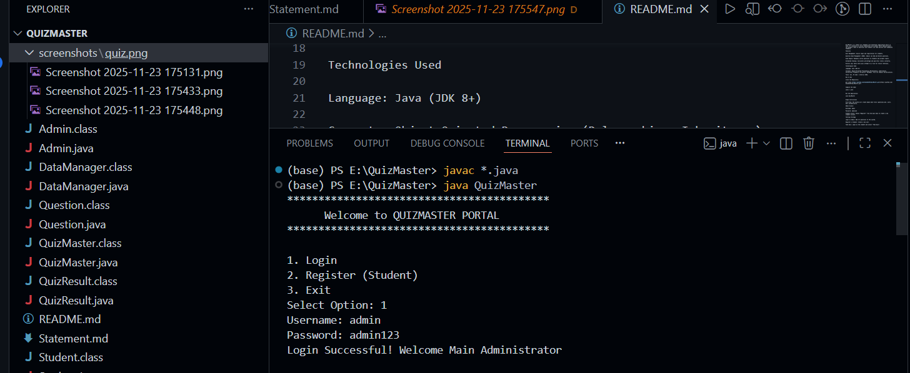

QuizMaster - Java Exam & Grading System

Overview

QuizMaster is a robust CLI (Command Line Interface) application built in Java. It simulates an online examination environment where administrators can manage a bank of questions and students can take quizzes with immediate feedback.

Features

User Management: Secure login and registration for students.

Question Bank Management (CRUD): Admins can Add and Delete questions.

Exam Engine: Randomly serves questions to students and accepts inputs.

Automated Grading: Calculates percentage and pass/fail status instantly.

History Log: Saves every quiz attempt to a file for future reference.

Technologies Used

Language: Java (JDK 8+)

Concepts: Object-Oriented Programming (Polymorphism, Inheritance), Collections Framework (ArrayList, HashMap), File I/O (Object Serialization).

Tools: Git, VS Code / IntelliJ IDEA.

How to Run

Clone the Repository:

git clone [https://github.com/Anand2k29/QuizMaster.git](https://github.com/Anand2k29/QuizMaster.git)

Compile the Code:

javac *.java

Run the Application:

java QuizMaster

Usage Instructions

First Run: The system will create empty data files (questions.dat, users.dat) automatically.

Admin Access:

Username: admin

Password: admin123

Student Access: Choose "Register" from the main menu to create a new student account.

Testing Strategy

Login as Admin: Add 3-4 questions to the system.

Register a Student: Create a new user.

Take Quiz: Login as the student and select "Take Quiz".

Verify Results: Check your score immediately. Log out and log back in to ensure the "My Results" history is saved.

Screenshots
## Screenshots

### Main Menu

### Quiz Running
